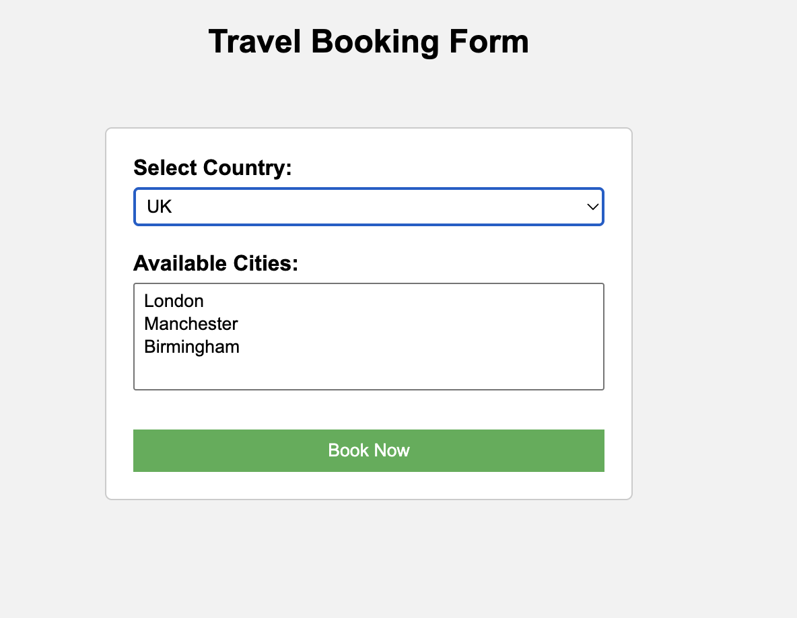

# Travel Booking Form

**Live Demo**  
https://ananyagpt1105.github.io/travel-booking-form-js/

## Preview

## About the Project
This project is a travel booking form where the list of cities dynamically updates based on the selected country. JavaScript is used to modify dropdown options and display the selected travel information.

## Features
- Country selection dropdown
- Dynamic city list based on selected country
- JavaScript alert displaying selected travel details
- Styled booking form layout

## Technologies Used
- HTML
- CSS
- JavaScript

## Concepts Practiced
- Dynamic dropdown menus
- DOM manipulation
- JavaScript functions
- Form handling
